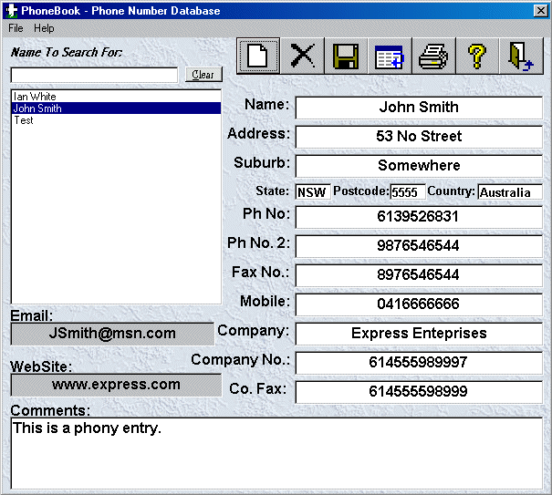



## A 00 PhoneBook \- Fixed The Runtime Bug

### Description

PLEASE FIND A BUG!!!!!!!!!!!!!!!!!!!!!!! I DARE YA! I fixed the one that was found when you type somthign in the main interface when you have an empty dat file then click in the search list box. See if u can find more. By the way PLEASE VOTE!!!! thanx ;-)

Well finally after heaps of emails complaining about the source safe protection HERE you go!! a non protected version, as you will see the code is a shocka, it really needs arrays. It reads everything off a text file to save HD Space. I am going to make an Access version prolly in about a month or so, well maybe longer coz i am doing my HSC. Anyway, this prog provides a simple to use, yet useful phonebook/contacts program. I have gone through and sussed out pretty much every bug I could think of, see if you can find any!

I DARE YA TO FIND A BUG!!!!!!!!!!!!!!!!!!!!!!
 
### More Info
 

             |
---                |---
**Submitted On**   |2001-07-21 09:26:32
**By**             |[Ian White](https://github.com/Planet-Source-Code/PSCIndex/blob/master/ByAuthor/ian-white.md)
**Level**          |Intermediate
**User Rating**    |4.2 (46 globes from 11 users)
**Compatibility**  |VB 5\.0, VB 6\.0, VBA MS Access
**Category**       |[Databases/ Data Access/ DAO/ ADO](https://github.com/Planet-Source-Code/PSCIndex/blob/master/ByCategory/databases-data-access-dao-ado__1-6.md)
**World**          |[Visual Basic](https://github.com/Planet-Source-Code/PSCIndex/blob/master/ByWorld/visual-basic.md)
**Archive File**   |[A 00 Phone231837202001\.zip](https://github.com/Planet-Source-Code/ian-white-a-00-phonebook-fixed-the-runtime-bug__1-25275/archive/master.zip)

